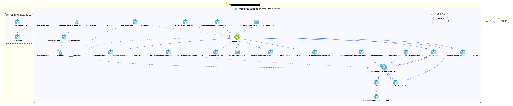

# In short
This folder represents the terraform HashiCorp Configuration Language (HCL) manifests for automated deployment to Microsoft Azure.

- `create` is the directory where the cluster creation manifests are stored, `aks-cluster.tf` uses the `hashicorp/azurerm` provider to create a set of Azure resources including but not limited to:
  - resource groups
  - single-node kubernetes cluster on germanywestcentral
  - public ip for Nginx
  - nginx helm charts
  - cert-manager helmcharts
- `variables.tf` stores the variables used in `aks-cluster.tf`, you should not have to edit the cluster file, only the variables file to make this work on your environment.
- `deploy` is the directory where the kubernetes resource configuration is stored, this is a kubernetes manifest file that has been converted to a HCL file to include in the terraform deployment.

These kubernetes `.yaml` manifests can be converted to `.hcl` manifests by following the write-up named `yaml2hcl.md`, this file explains the whole process of converting the files.

## Steps to reproduce the environment
### Create service principal in the Azure Bash shell
`az ad sp create-for-rbac --name stutor-app`

0. add the `client_secret` and `client_id` from the step above to the `variables.tf` file
1. install Terraform
2. `cd stutorserver/infrastructure/terraform/create`
3. `terraform init`
4. `terraform plan && terraform apply`

### Cluster has now been initialized, only deployment of resources is left
\
Before manifest/stutor_azure_ingress_ssl.tf can be executed you have to write the kubeconfig file with this command:\
`az aks get-credentials --resource-group stutor-rg --name stutor-aks`

1. `cd ..\deploy`
2. `terraform init`
3. `terraform plan && terraform apply`

```
Do you want to perform these actions?
  Terraform will perform the actions described above.
  Only 'yes' will be accepted to approve.

  Enter a value: yes

kubernetes_persistent_volume_claim.stutor_pvc: Creating...
kubernetes_manifest.secret_stutor_stutorsecrets: Creating...
kubernetes_manifest.ingress_stutor_stutor_ingress: Creating...
kubernetes_manifest.clusterissuer_stutor_letsencrypt_prod: Creating...
kubernetes_manifest.service_stutor_stutor_db_service: Creating...
kubernetes_manifest.service_stutor_stutor_service: Creating...
kubernetes_manifest.statefulset_stutor_stutor_db: Creating...
kubernetes_manifest.deployment_stutor_stutor_deployment: Creating...
kubernetes_manifest.secret_stutor_stutorsecrets: Creation complete after 2s
kubernetes_manifest.ingress_stutor_stutor_ingress: Creation complete after 3s
kubernetes_manifest.service_stutor_stutor_service: Creation complete after 3s
kubernetes_manifest.service_stutor_stutor_db_service: Creation complete after 4s
kubernetes_manifest.clusterissuer_stutor_letsencrypt_prod: Creation complete after 4s
kubernetes_manifest.statefulset_stutor_stutor_db: Creation complete after 4s
kubernetes_manifest.deployment_stutor_stutor_deployment: Creation complete after 5s
kubernetes_persistent_volume_claim.stutor_pvc: Still creating... [10s elapsed]
kubernetes_persistent_volume_claim.stutor_pvc: Creation complete after 14s [id=stutor/stutor-pvc]

Apply complete! Resources: 8 added, 0 changed, 0 destroyed.
```
## sources on which the setup is based:
- https://www.hashicorp.com/blog/kubernetes-cluster-with-aks-and-terraform
- https://github.com/mstrother/terraform-aks-appgw-ingress
- https://github.com/Azure-Terraform/terraform-azurerm-kubernetes-nginx-ingress

## Azure infrastructure

